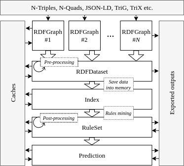

# RdfRules

RdfRules is a fast analytics engine for rule mining in RDF knowledge graphs. It offers tools for complex rule mining process including RDF data pre-processing and rules post-processing. The core of RdfRules is written in the Scala language. Besides the Scala API,
RdfRules also provides a Java API, REST web service and a graphical user interface via a web browser. RdfRules uses the AMIE+ algorithm with several extensions as a basis for a complete solution for linked data mining.

## Getting started

RdfRules is divided into four main modules. They are:
 - Scala API: It is sutable for Scala programmers and for use RdfRules as a framework to invoke mining processes from Scala code.
 - Java API: Similar to Scala API but adapted for Java programmers.
 - Web Service: It is suitable for modular web-based applications and remote access via HTTP.
 - GUI: It is suitable for anyone who wants to use the tool quickly and easily without any needs for further programming.
 
 Detailed information about these modules with deployment instructions are described in their subfolders...
 
 ## Design and Architecture
 

 
The architecture of the RdfRules core is composed of four main data abstractions: RdfGraph, RdfDataset, Index and RuleSet. These objects are gradually created during processing of RDF data and rule mining. Each object consists of several operations which either *transform* the current object or perform some *action* to create an output. Hence, these operations are classied as transformations or actions.

### Transformations
Any transformation is a lazy operation that converts the current data object to another. For example a transformation in the RdfDataset
object creates either a new RdfDataset or an Index object.

### Actions

An action operation applies all pre-dened transformations on the current and previous objects, and processes (transformed) input data to create a desired output such as rules, histograms, triples, statistics etc. Compared to transformations, actions may load data into memory and perform time-consuming operations.

### Caching

If we use several action operations, e.g. with various input parameters, over the same data and a set of transformations, then all the defined transformations are performed repeatedly for each action. This is caused by lazy behavior of main data objects and the streaming process lacking memory of previous steps. These redundant and repeating calculations can be eliminated by
caching of performed transformations. Each data object has the cache method that can perform all defined transformations immediately and store the result either into memory or on a disk.

## Main Abstractions

### RdfGraph

The *RdfGraph* object is a container for RDF triples and is built once we load an RDF graph. It can either be a file or a stream of triples or quads in a standard RDF format such as N-Triples, N-Quads, JSON-LD, TriG or TriX. If the input format contains a set of quads (with information about named graphs) all triples are merged to one graph. Alternatively, we can create directly the *RdfDataset* object (see below) from quads and to preserve the distribution of triples in the individual graphs. This object has defined following main operations:

#### Transformations

Operation | Description
------------ | -------------
map(*func*) | Return a new *RdfGraph* object with mapped triples by a function *func*.
filter(*func*) | Return a new *RdfGraph* object with filtered triples by a function *func*.
take(*n*), drop(*n*), slice(*from*, *until*) | Return a new *RdfGraph* object with filtered triples by cutting the triple set.
discretize(*task*, *func*) | Return a new *RdfGraph* object with discretized numeric literals by a predefined *task*. It processes such triples which satisfy a function *func*.

#### Actions

Operation | Description
------------ | -------------
foreach(*func*) | Apply a function *func* for each triple.
histogram(*s*, *p*, *o*) | Return a map where keys are items and values are numbers of aggregated items. Parameters *s*, *p*, *o* represents booleans determining which triple items should be aggregated.
types() | Return a list of all predicates with their type ranges and frequencies.
cache(*target*) | Cache this *RdfGraph* object either into memory or into a file on a disk.
export(*target*, *format*) | Export this *RdfGraph* object into a file in some familiar RDF format.

### RdfDataset

The *RdfDataset* object is a container for RDF quads and is created from one or many *RdfGraph* instances. This data object has the same operations as the *RdfGraph*. The only difference is that operations do not work with triples but with quads.

#### Transformations

Operation | Description
------------ | -------------
map(*func*) | Return a new *RdfDataset* object with mapped quads by a function *func*.
filter(*func*) | Return a new *RdfDataset* object with filtered quads by a function *func*.
take(*n*), drop(*n*), slice(*from*, *until*) | Return a new *RdfDataset* object with filtered quads by cutting the quad set.
discretize(*task*, *func*) | Return a new *RdfDataset* object with discretized numeric literals by a predefined *task*. It processes such quads which satisfy a function *func*.
addGraph(*graph*) | Return a new *RdfDataset* with added *graph*.
index(*mode*) | Create an *Index* object from this *RdfDataset* object.

#### Actions

Operation | Description
------------ | -------------
foreach(*func*) | Apply a function *func* for each quad.
histogram(*s*, *p*, *o*) | Return a map where keys are items and values are numbers of aggregated items. Parameters *s*, *p*, *o* represents booleans determining which triple items should be aggregated.
types() | Return a list of all predicates with their type ranges and frequencies.
cache(*target*) | Cache this *RdfDataset* object either into memory or into a file on a disk.
export(*target*, *format*) | Export this *RdfDataset* object into a file in some familiar RDF format.

### Index
